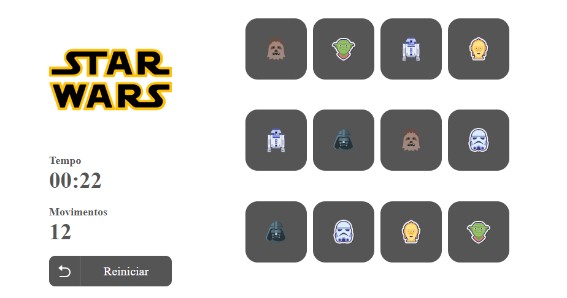

# Star Wars Memory

Projeto em React + Typescript de um jogo de memória de personagens do Star Wars

Projeto desenvolvido durante o curso B7Web. 

### Instalação
- `npm install`

### Para rodar 
- `npm start`

[Clique aqui para acessar](https://github.com/BrendondeJesus/StarWarsMemory.git)

## Tecnologias

- HTML
- CSS
- Typescript 
- React
- Git e Github

## Contato

brendondejesus@hotmail.com